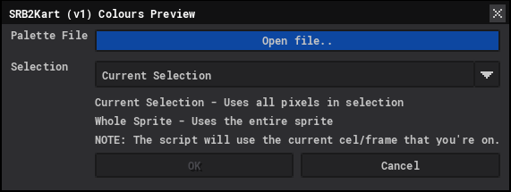
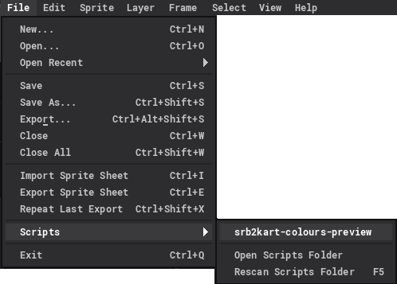
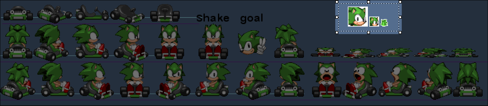
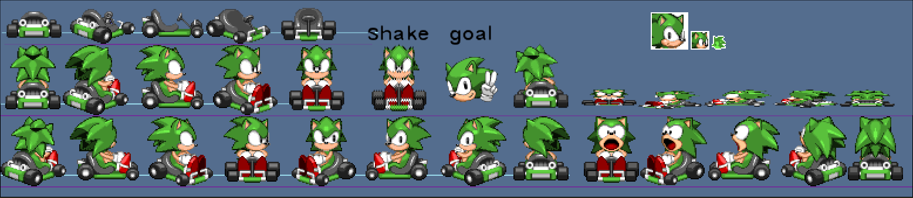

# <b>SRB2Kart (v1) Colours Preview</b>

A Lua script for [Aseprite](https://www.aseprite.org/) which applies all of the in-game colours to the sprites.

Full list of colours can be found [here](https://wiki.srb2.org/wiki/SRB2Kart/List_of_skin_colors).

# Installing the script

Open Aseprite and open your <b>scripts</b> folder; <code>File ⟶ Scripts ⟶ Open Scripts Folder</code> 

From there, paste the script inside and rescan your folder so Aseprite detects it, either by pressing <code>F5</code> or <code>File ⟶ Scripts ⟶ Rescan Scripts Folder</code>. If everything went well, you should see <code>srb2kart-colours-preview</code> as a script.

Something like this:

# Instructions

## <b>1. Palette File</b>
Select a SRB2Kart palette file. This can either be a <code>.pal</code> or <code>.png</code>. If you don't have your own, you can use the provided <code>srb2kart-pal.png</code>.

## <b>2. Selection</b>

    NOTE: The script uses the current cel/frame as reference, so make sure you're on the right one!

You can change what the script processes by choosing between <code>Current Selection</code> or <code> Whole Sprite</code>.

### Current Selection (Default)

The script will only process what you have highlighted; this option will open a new sprite for you.

### Whole Sprite

This script will process the entire sprite. 

There are a few prerequisites if you choose this option:

* The sprite has to be in <b>Indexed</b> mode. If not, you can change it via <code>Sprite ⟶ Color Mode ⟶ Indexed</code>.
* The palette has to already be imported; you can use the same <code>srb2kart-pal.png</code>. If you don't know how to load the palette, here's how:

## <b>3. Finally ..</b>

Once you're happy with everything, just press <b>OK</b> and the script will do its thing. If you're still unsure, take a look at the <code> Examples</code> section below to see how the script works for both of the aforementioned choices.

# Examples

Short videos showing the script in action.

* [Using <code>Current Selection</code>.](https://wadsauce.me/script-examples/current_selection_example.webm)
* [Using <code>Whole Sprite</code>.](https://wadsauce.me/script-examples/whole_sprite_exmp.webm)